# Wisconsin Breast Cancer Prediction
## About

We are going to use <a href=https://archive.ics.uci.edu/dataset/17/breast+cancer+wisconsin+diagnostic>Wisconsin's Breast Cancer Diagnosis dataset</a>. The dataset has 569 samples and 32 variables. These variables were obtained through the analysis of the characteristics of the cellular nuclei from digitized images of breast tissue samples acquired through fine needle aspiration [FNA] biopsy techniques. An example of two different images obtained through these techniques can be seen below, a benign case on the left and malign on the right. 

  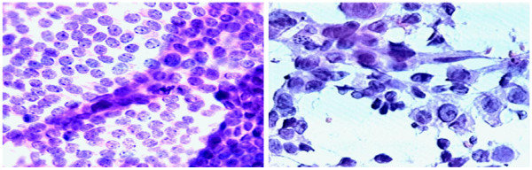

If we take a look at the variables we can see all but the id and target variable ('diagnosis') are presented divided in three metrics according to their suffix: _mean (average of all samples), _se (standard error) and _worst (average of three worst values). Brief explanation of these variables: 

<ul>
<li><b>radius:</b> distance from the center of the nuclei to points in the perimeter
<li><b>texture:</b> standard deviation of values in the grayscale
<li><b>perimeter:</b> perimeters of the nuclei in the image
<li><b>area:</b> areas of the nuclei in the images
<li><b>smooothness:</b> local variations of the radius elongation. Measure of cells's border irregularities
<li><b>compactness:</b> perimeter^2/area - 1.0
<li><b>concavity:</b> severity of the concave portions in the contour. Understanding as more severe or higher concavity, those contours with many "gaps" or depressions. In a broader sense, it can indicate how irregular the shape of the nucleus is.
<li><b>symmetry:</b> symmetry of the nuclei. Calculation method unspecified
<li><b>fractal_dimension:</b> measures how 'irregular' the nuclei's contour is
</ul>

As for <b>id</b> and <b>diagnosis</b> they are just a unique identifier and the target variable [M=malign, B=benign].

## Procedure

The objective will be to develop an effective model for breast cancer diagnosis and look into the main features that suggest this diagnosis. The metric for success we are going to use is the f1-scoe. We could conside scenarios where other metrics might be more suitable:
<ul>
<li> Wrongly diagnosing a patient's cell as malign and thus unnecessarily moving them to the proceding treatment carries severe consequences and threatens the patient's life. In that case, we would want to maximize precision so we do not commit any type I error. 
<li> (Most logical one) After diagnosing a patient's cell as malign, further test will be carried out to confirm the diagnosis. In this case we want to reduce the number of false negatives therefore we are going to maximize recall.
</ul>
Recall would be a logical choice too, however, we are going to use f1-score this time and aim for a compromise. The steps will be the standard:
<ol>
<li>EDA
<li>Data Preprocessing
<li>Feature Engineering and Selection
<li>Model development
<li>Model evaluation and final analysis
</ol>

## EDA

For starters we confirm there are no missing values or duplicates. If there were missing values in any columns we would have to check the extent and proportion to choose our approach. Now we will set 'id' column as index, since it is unique and serves no other purpose and check for correlation in our data.

We can see strong correlation between size related (radius, area and perimeter) variables in all measures as well as between concavity, concave points and compactness. Mean and worst values as it is to be expected also show high correlation. Given the high number of variables and to avoid multicolinearity we will proceed to apply feature selection techniques (L1, PCA, RFE, RFI...). To ease further analysis, we will split our data into three different dataframes each addressing a different statistic (mean, se or worst) since the relationship between the variables its similar across all statistics and among them.

  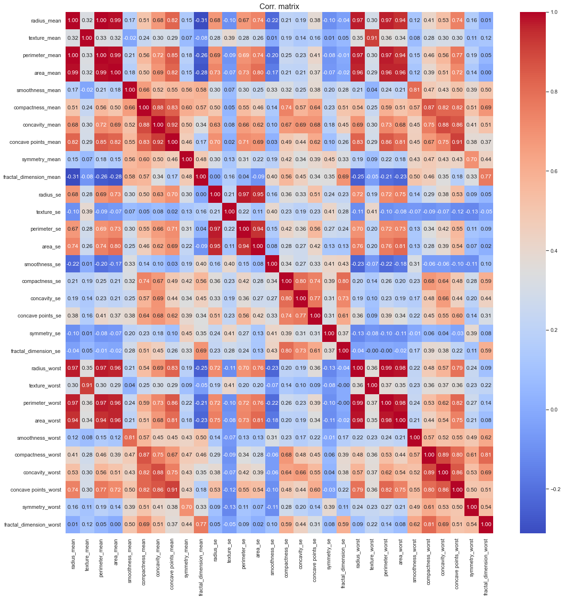

We can further confirm the issue with the multicolinearity by printing and checking VIF, having almost all values above the standard acceptable threshold of 10 and some with extreme values. We can take a better look at the relationships between variables by taking a look at the pairplot, seeing some seemingly linear relationships between some of the variables.
 

  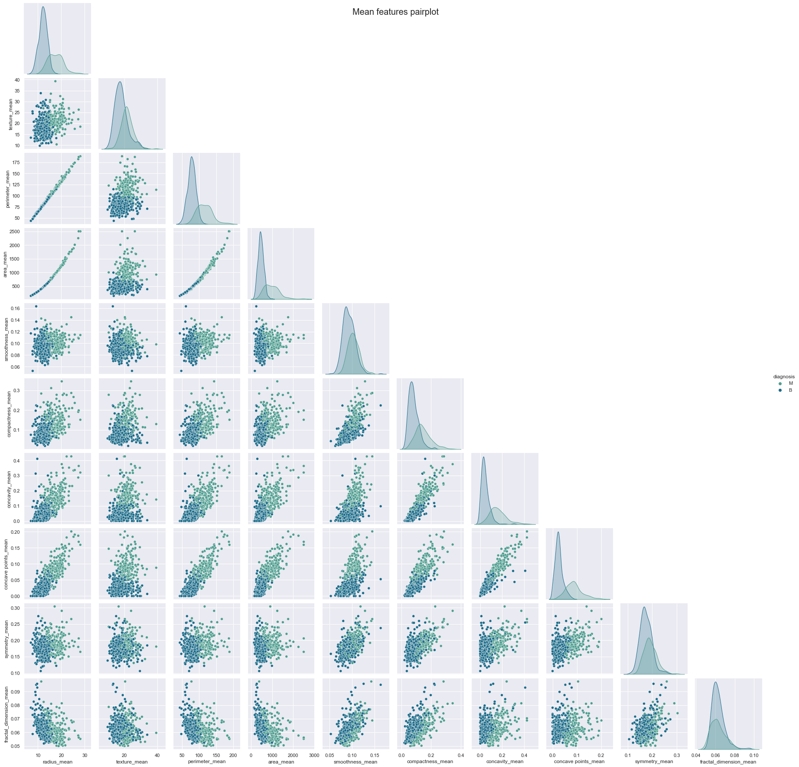

Looking at the box plots and taking a closer look at the pairplots we can possible outliers. Given the nature of the data and our lack of knowledge on the field, we are going to assume these are reasonable values and not caused by some human or machine transcription mistake, and therefore we will assume they provide useful information and keep them.

  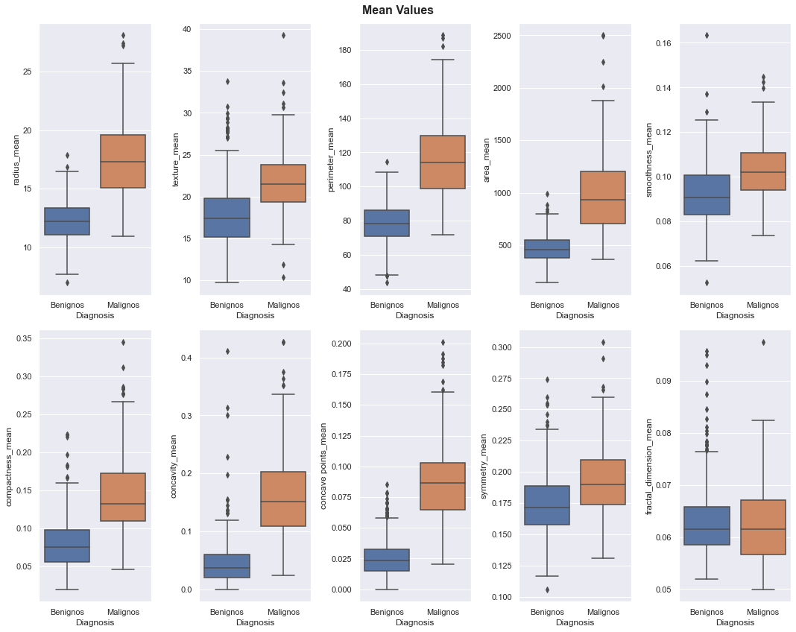

  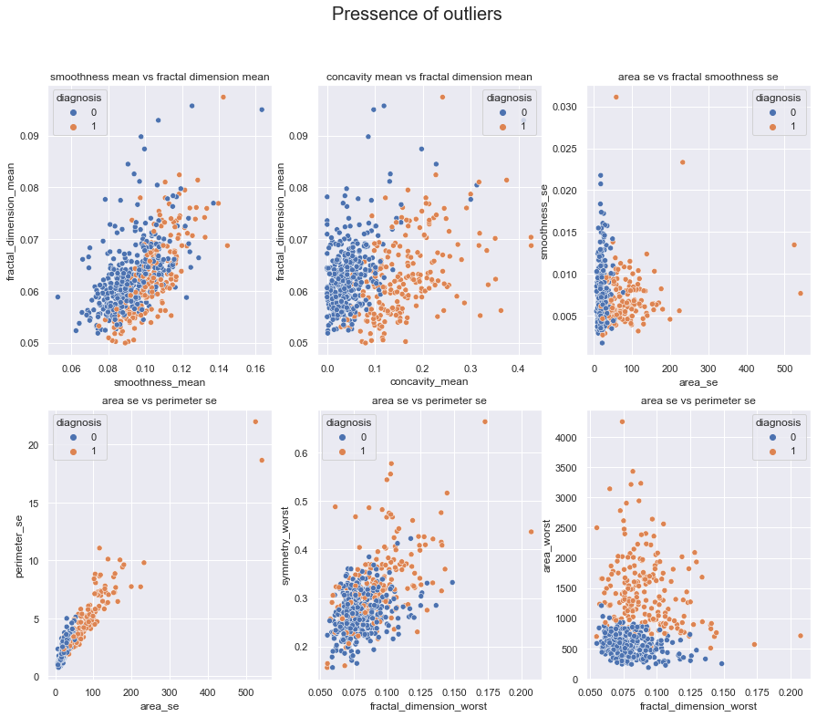

## Data Preprocessing

First of all, we are going to encode the labels of categorical variables in this case of our target variable. We will also apply standard scaling to our numerical variables before feeding the data to the models. Lastly we will split the data into training (80%) and testing (20%)

As for class imbalances, there is some, however, given the difference it's not too big and to avoid overfitting our model we are going to stick with the currenst samples and stratify when splitting the data.

  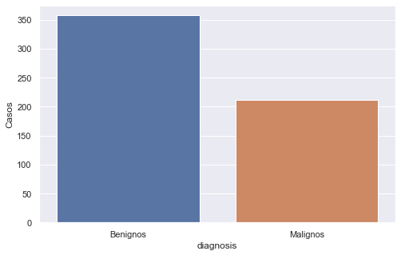

## Feature Selection

As mentioned earlier, to deal with multicolinearity and reduce the number of features we are going to apply some feature selection, in this case we will use L1. For that we did some fine tuning of the C hyperparameter to choose a good compromise between the complexity of the model and the number of features. After training, we decide to opt for C=0.5 as to not remove too many features and have a simple model (C=0.1 case) and not get too far away from optimum (C=1.0 for example)
 

  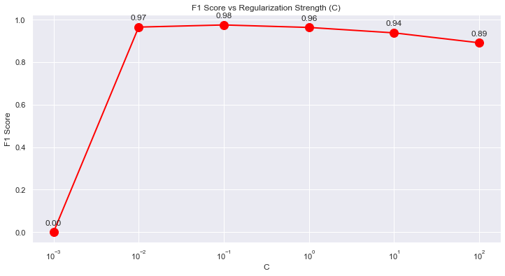
  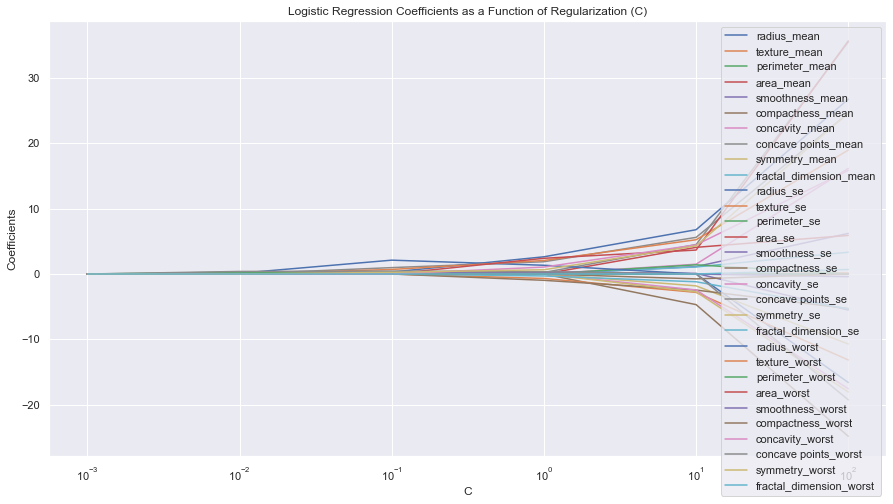

Examining the weights of the selected features, our model indicates that the most important variable for cancer diagnosis is <b>radius_worst</b> followed by a big margin by texture_worst and concave_points_mean. After setting a threshold of 0.15 importance for our selection we are left with 8 variables to work with: 'concave points_mean' 'radius_se' 'radius_worst' 'texture_worst' 'area_worst' 'smoothness_worst' 'concave points_worst' 'symmetry_worst'.
 

  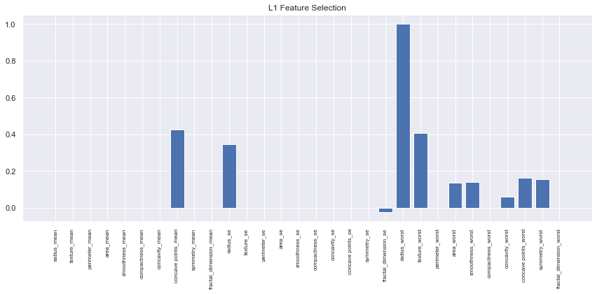

## Model Development and Evaluation

Our baseline L1 Logistic Regression Model already provides very promising results, nevertheless, we will try out two more models: Random Forest using our selected features and an MLP with the raw data to leave the conclussions up to the neural net. After training, we obtained the best results from the MLP as shown below, with an F1 score of <b>0.987952</b>.
 

 
  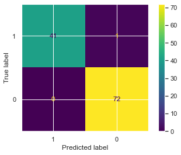
  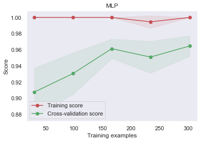
  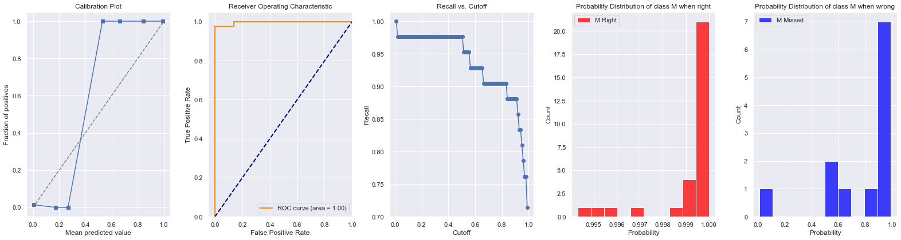

Random Forest did not perform as well, however we took a look at the assigned feature importance from the model and gatheres similar conclussions as from the Lasso. The most important variables seem to be <b>radius_worst</b> and <b>concave_points_mean</b>
 

  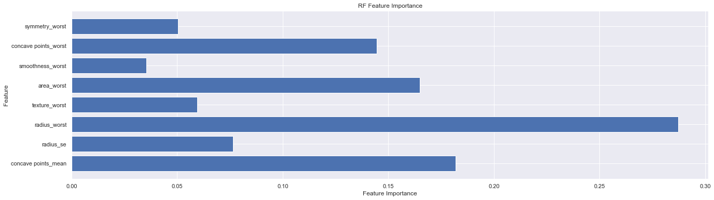

## Conclusions

The best results were obtained by the MLP (fed with the raw data). L1 Logistic Regression achieved results almost as good as MLP. While the MLP achieves the highest F1 score, I would stick with Logistic Regression for its simplicity and explainability which might come in handy if required to provide explanations. The determining factors for cancer diagnosis indicated by the model were <b>radius_worst</b> and <b>concave_points_mean</b>.
  

Final results:

  

 

| Model | Precision | Recall | F1 Score |
|----------|----------|----------|----------|
| MLP    | 1.0  | 0.976190  | 0.987952  |
| L1 Log. Reg.    | 1.0  | 0.952381  | 0.975610  |
| Random Forest    | 1.0  | 0.928571  | 0.962963  |

